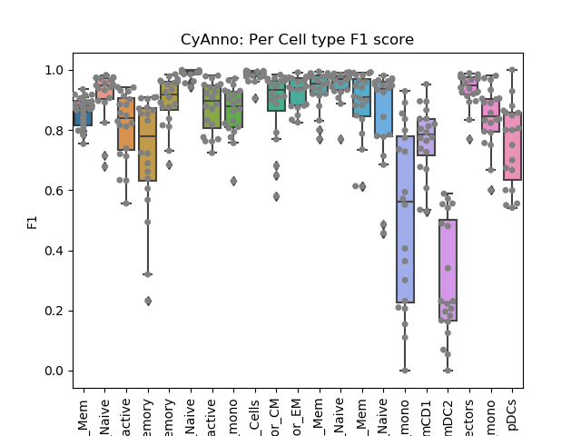

## Vignette
Replicating results of orignal manuscript from POISED dataset

# 1. About POISED dataset
POISED dataset (Chinthrajah et al., 2019)) includes 30 CyTOF samples from human PBMCs of peanut-allergic individuals, for testing or benchmarking the CyAnno algorithm. For more information please refer [#1](https://www.thelancet.com/pdfs/journals/lancet/PIIS0140-6736(19)31793-3.pdf) and [#2](https://www.biorxiv.org/content/10.1101/2020.08.28.272559v1) 

# 2. Dataset design
The dataset consists of 30 CyTOF samples with a panel of 39 marker (21 lineage + 18 functional markers), in which 15 samples were peanut stimulated and 15 samples were untreated. These samples were processed across 7 batches and 21 cell types were manually gated (including closely related cell types as well as non-canonical rare cell types).The non-canonical peanut reactive T cells used in this study were CD69+ CD40L+ CD4+ T cells and CD69+ CD8+ T cells (Neeland et al., 2020). Cells not the part of any of the 21 gated cell population are labelled as "Unknown", this may includes "ungated" cells or cells with "unknown" phenotype.

# 3. Dataset availability
Raw unlabeled POISED dataset files in FCS 3.0 format and normalized labelled CSV format can be obtained from [FlowRepository](https://flowrepository.org/) (FR-FCM-Z2V9; temporarily restricted for public access). Howevever, for executing CyAnno on POISED dataset and replicating results of the orignal manuscript, unnormalized FCS files of "manually gated" cell types (training dataset) as well as "unlabelled" live cells (test dataset) can be obtained using the instructions available in section 4.1.

# 4. CyAnno: Step by Step instructions
Please follow to the instructions to train the CyAnno models using just 3 POISED CyTOF samples and label the cell from 20 different POISED CyTOF samples. In theory, 3 or more samples should be enough to train CyAnno in order to label the live cells from (any number of) "unlabelled" samples, given training samples are not significantly different from "unlabelled" samples, in terms of marker expression profile due to batch effects, external stimulation(s) or any other factor.

### 4.1 Step 1: Clone the repository and download the POISED dataset

Before you begin please install [gdown](https://github.com/wkentaro/gdown) python library. 

``` pip install gdown ```   or   ```conda install -c conda-forge gdown```

Now clone the repository and using the python script download: 
1. 30 FCS files, one for each sample of POISED dataset 
2. Corresponding live cell labels (manually gated) for each cell of every sample.
3. Manually gated FCS files, one for each cell type from every sample.

Note: Here we have used FCS files, however, you can use both CSV or FCS files as an input.
```
git clone https://github.com/abbioinfo/runPOISED.git
cd runPOISED
python Download.py
```

### 4.2 Step 2: Check the arguments and execute CyAnno

(Optional) Open CyAnno.py with text editor or python IDE. Mandatory arguments should include the path of files we just downloaded. You can change the name of project (projectname). 

Note: To replicate the results of orignal CyAnno article it is it is recommended that you do not change any of the paramater (keep everything default). You can change any hyper-parameter, otherwise, as per the need of your project. The main arguments in CyAnno.py should look like this

```
##### Mandatory ######

handgatedFileinfo='TrainingDataset_manuallygated.csv' 
LiveFileinfo= 'TrainingDataset_live.csv'    
unlabelledDataset= 'TestingDataset_live.csv'  
relevantMarkers = ['CD19','CD49b','CD4','CD8','CD20','LAG3','CD123','CD3','HLA.DR','CD69',
                       'CD33','CD11c','CD14','CD127','CCR7','CD25','CD56','TCRgd','CD16',
                       'CD40L','CD45RA','CD27']
ProjectName = "POISED" 

```

Now we will label 20 FCS files with the manually gated FCS files belonging to only 3 samples (i.e. training dataset). These 3 samples are randomly selected from remianing 10 samples. The list of files used in training dataset are available in 
1. "TrainingDataset_live.csv" : Containing list of 3 FCS files (training samples) of live cells from which 22 cell types were manually gated.
2. "TrainingDataset_manuallygated.csv" : Containing list of manually gated (22 * 3) FCS files, i.e. 22 FCS files (one for each cell type) from 3 selected training sample.
3. "TestingDataset_live.csv": Containing the list of 20 randomly selected (non-training) FCS files of live cells for cell labeling.

(Optional) If you want to recreate a different training and test dataset. Please check out the R script within the folder "createinput". Execute The R scipt using following commands:
```
cd createinput
Rscript CreateInput4CyAnno.R
```

Ok. Enough of the background. Lets excecute CyAnno from the main working directory:

```

python CyAnno.py

```

You can monitor the log file within $PROJECTNAME (e.g. POISED_XXXYYYXX). This may take a while (6-8 hours), depending upon the hardware. If you want faster execution change method (in CyAnno.py) from 'e' to 'x' . Here 'x' stands for XGboost and 'e' stands for 'ensemble'.

### Step 4.3 Check the output files
The most important output files are *XXX_labelled.csv* file. Each CSV file contains (normalized) marker expression profile for a given sample. The last column contains the predicted labels.

In addition, \_model and \_other folder contains the session files, important if you want to annotate other samples using the same models.

### Step 4.3 Compute and plot sample F1 and cell type sepcific F1

(optional) Since, we also have the manually gated labels available for our 20 test samples (in POISED_lables/ directory). we will check how well CyAnno performed in annotating the cells of the test sample. This testing is only for evaluating CyAnno and is not required for your own dataset. To plot F1 accuracy score, execute:

```
Rscript plot.py [PATH TO POISED PROJECT DIRECTORY]
```
The script will compute the F1 score measure of similarity between expected vs predicted labels. Higher the F1 (ranges between 0.0 to 1.0), better the similarity for the given sample or cell type. The plot should look like this




